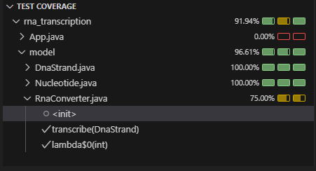

# 🌟 RNA Transcription

## 📄 Descripción
Este proyecto implementa la transcripción de ADN a ARN en **Java puro** siguiendo la metodología **TDD (Test-Driven Development)**.  
El objetivo es transformar una secuencia de ADN en su cadena complementaria de ARN, reemplazando cada nucleótido según las reglas de transcripción:

| **Nucleótido ADN** | **Nucleótido ARN** |
|-------------------|-------------------|
| G | C |
| C | G |
| T | A |
| A | U |

Este proyecto forma parte de una iniciativa para el desarrollo de soluciones bioingenieriles en terapias de interferencia de ARN.

## 🚀 Tecnologías Utilizadas
- **Java** (versión 17 o superior)
- **JUnit 5** (para pruebas unitarias)
- **Maven** (para gestión de dependencias)

## 🛠️ Instalación y Ejecución
### 🔢 1️⃣ Clonar el repositorio
```sh
git clone https://github.com/LannyRivero/RNA-TRANSCRIPTION.git
cd rna-transcription
```

### 🔢 2️⃣ Compilar el proyecto
Si usas **Maven**:
```sh
mvn clean compile
```


### 🔢 3️⃣ Ejecutar pruebas
Si usas **Maven**:
```sh
mvn test
```

## 📊 Cobertura de Código
Este proyecto mantiene una **cobertura de pruebas mínima del 70%**.  
Para generar el informe de cobertura, ejecuta:



## 🤝 Contribuir al Proyecto
💪 ¡Las contribuciones son bienvenidas! Si deseas mejorar este proyecto, sigue estos pasos:

### 🔢 1️⃣ Fork del repositorio
Haz un **fork** del repositorio en GitHub y clónalo en tu máquina:
```sh
git clone https://github.com/tu-usuario/rna-transcription.git
cd rna-transcription
```

### 🔢 2️⃣ Crea una nueva rama
```sh
git checkout -b feature-nombre-de-tu-mejora
```

### 🔢 3️⃣ Realiza cambios y pruebas
Realiza las modificaciones necesarias en el código y ejecuta los tests:
```sh
mvn test  # Para Maven
```

### 🔢 4️⃣ Confirma y sube los cambios
```sh
git add .
git commit -m "Agrega una nueva funcionalidad para XYZ"
git push origin feature-nombre-de-tu-mejora
```

### 🔢 5️⃣ Crea un Pull Request
Ve a [GitHub](https://github.com/tu-usuario/rna-transcription) y abre un **Pull Request** con los cambios.

### 🔢 6️⃣ Espera la revisión
El equipo revisará los cambios y, si todo está bien, ¡tu contribución será aceptada! 🚀

## 📚 Licencia
Este proyecto está bajo la **Licencia MIT**.

